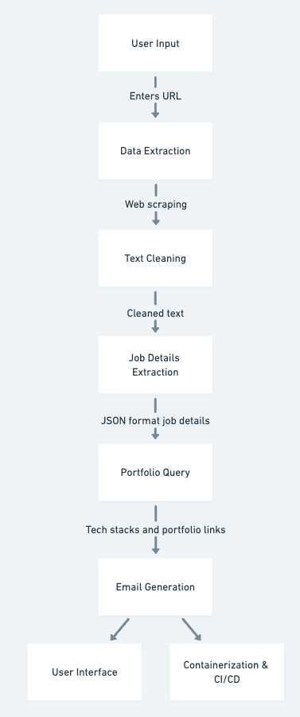
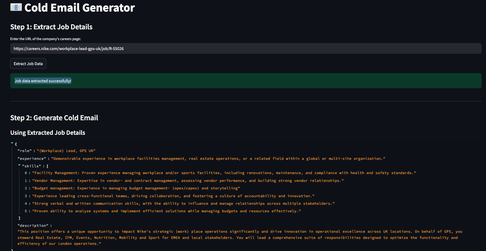
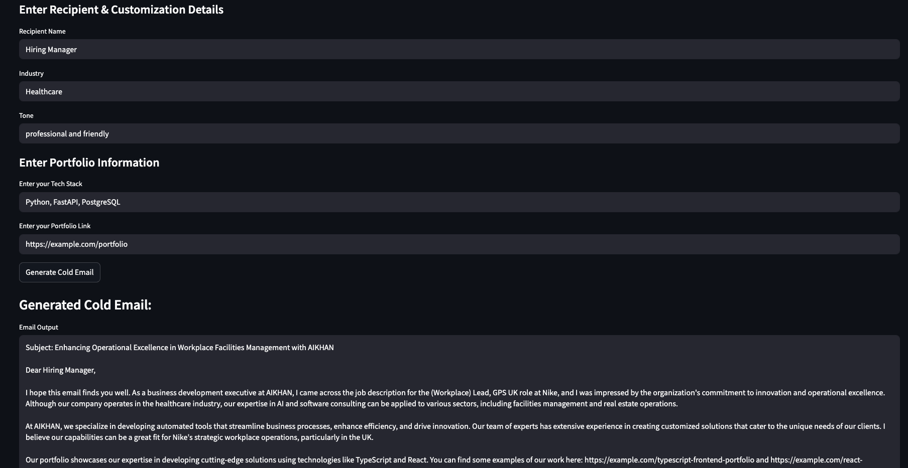

# Cold Email Generator – AIKHAN

*A comprehensive solution that extracts job details from a careers page URL and generates personalized cold emails using advanced NLP techniques, containerized with Docker and automated via CI/CD.*

---

## Project Overview

In today’s competitive business landscape, connecting with potential clients effectively is key. The **Cold Email Generator** project addresses this by automatically extracting job details from a company’s careers page, querying a portfolio database for relevant links, and generating a highly personalized cold email using generative AI. This end-to-end solution demonstrates expertise in web scraping, data processing, vector search, NLP, containerization, and CI/CD.

---

## Data Story

### Aim & Goal

- **Aim:**  
  Develop a data-driven system capable of generating tailored cold emails that bridge the gap between job listings and business opportunities.

- **Goal:**  
  Empower business development executives at AIKHAN to efficiently create personalized cold emails by leveraging scraped job data and a vector-based portfolio database, all deployed via a scalable containerized infrastructure with automated CI/CD.

### Problem Statement

Companies like Nike invest substantial resources in hiring and onboarding, yet reaching out with personalized offers remains challenging. Traditional outreach methods often lack customization and context. Our solution uses generative AI to automatically generate cold emails that highlight AIKHAN's strengths, making the outreach process both efficient and compelling.

### Our Approach

1. **Data Extraction & Cleaning:**  
   - **User Input:** The user enters the URL of a company’s careers page through an intuitive Streamlit UI.
   - **Web Scraping:** A web loader fetches and cleans the page content to isolate job details.

2. **Job Details Extraction:**  
   - A generative AI model processes the cleaned text to extract key job information (role, experience, skills, and description) in JSON format.

3. **Portfolio Query:**  
   - A preloaded vector database (ChromaDB) is queried to retrieve portfolio links relevant to the job’s required skills.

4. **Cold Email Generation:**  
   - The system combines the extracted job details, portfolio links, and user-provided recipient details (name, industry, tone) to generate a structured, personalized cold email.
  
5. **Containerization & CI/CD:**  
   - The solution is fully containerized with Docker and orchestrated via Docker Compose.
   - A GitHub Actions workflow automates building, testing, and deployment to ensure production readiness.

---

## Workflow Diagram

Below is the **Workflow Diagram** illustrating each stage—from data ingestion and ETL to containerized deployment and user interaction:



### Key Skills & Technologies

- **Data Engineering & ETL:** Web scraping, text cleaning, and data preprocessing.
- **NLP & AI:** Job detail extraction and email generation using LangChain, Groq, and generative models.
- **API Development:** Building FastAPI endpoints for job data extraction and email generation.
- **Vector Search:** Querying a ChromaDB vector database for portfolio links
- **User Interface:** Interactive UI using Streamlit.
- **Containerization:** Docker and Docker Compose for consistent deployment.
- **CI/CD:** Automated build and test processes using GitHub Actions.

### How the Cold Email Generator Works

Below is a screenshot of the **Streamlit app**:



### Using the Streamlit App

1. **Extract Job Details:**
   - Input: Enter the URL of a company’s careers page.
     Example URL: https://careers.nike.com/workplace-lead-gps-uk/job/R-55026
     
   - Process: The system scrapes the page, cleans the content, and extracts job details such as role, experience, skills, and description.

2. **Generate Cold Email:**
   - Input: After extraction, provide recipient details (e.g., Recipient Name: Hiring Manager), specify the industry (e.g., Healthcare), and set the tone (e.g., professional and friendly)
     
   - Process: The system queries a portfolio database to retrieve relevant links and then uses a generative model to create a personalized cold email.



3. **Sample Generated Output:**
    Subject: Enhancing Operational Excellence in Workplace Facilities Management with AIKHAN

    Dear Hiring Manager,

    I hope this email finds you well. As a business development executive at AIKHAN, I came across the job description for the (Workplace) Lead, GPS UK role at Nike, and I was impressed by the organization's commitment to innovation and operational excellence. Although our expertise primarily lies in healthcare, our cutting-edge AI and software consulting solutions can be applied to streamline and optimize your facility management processes.

    Our portfolio includes successful projects leveraging modern technologies such as TypeScript, React, and Python. For example, you can view our work here: 
    - https://example.com/typescript-frontend-portfolio  
    - https://example.com/react-portfolio

    I would welcome the opportunity to discuss how AIKHAN can support Nike’s strategic workplace operations and drive innovation in facilities management. Please let me know if you would be available for a call to explore this further.

    Best regards,

    Asad  
    Business Development Executive  
    AIKHAN
   
### Project Setup

### Local Setup

1. **Clone the Repository:**
   ```bash
   git clone https://github.com/yourusername/genai_cold_email_generator.git
   cd genai_cold_email_generator

2. **Install Dependencies:**
   ```bash
   pip install -r requirements.txt

3. **Run the API Locally:**
   ```bash
   uvicorn src/api/app:app --host 0.0.0.0 --port 8080 --reload
- Visit http://localhost:8080 to verify the API.

4. **Run the Streamlit UI:**
   ```bash
   streamlit run src/ui/streamlit_app.py
- Access the UI at http://localhost:8501.

### Containerization 

1. **Build and Run with Docker Compose:**
   ```bash
   docker-compose up --build
- The API is available at http://localhost:8080 and the UI at http://localhost:8501.

### CI/CD Integration

- A GitHub Actions workflow (.github/workflows/docker_build.yml) is configured to automatically build your Docker images, run tests, and verify that the containers are accessible on every push or pull request.

### License

This project is licensed under the MIT License.


### Contributors

**Asad Faiyyaz Khan**

**By integrating advanced data engineering, NLP, vector search, containerization, and CI/CD, this project demonstrates a complete, 
production-ready pipeline for generating personalized, domain-specific cold emails..**
